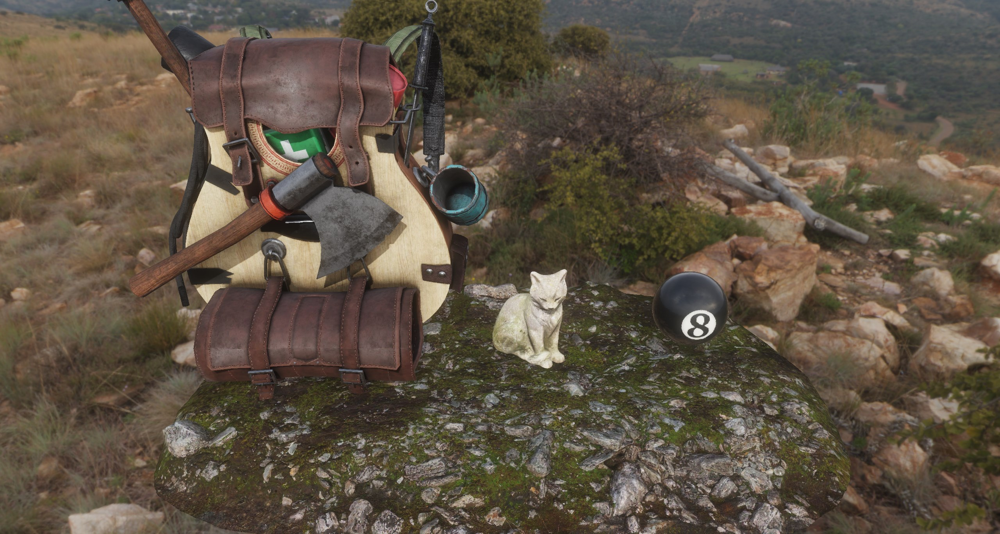

# OpenGL Scene

This is the OpenGL scene made in C++ during the Graphics Programming module at SAE Institute.



It has :

- Physically Based Rendering (PBR)
- Image Based Lighting (IBL)
- Deferred Rendering
- Cascaded Shadow Maps
- Normal Mapping
- ACES HDR Tone Mapping
- Bloom
- Screen Space Ambient Occlusion (SSAO)
- Scene Graph
- Model Loading (OBJ and glTF)
- KTX Textures Loading

You can read more about the implementation details of this project in this blog
post : https://blog.stowy.ch/posts/how-i-implemented-a-deferred-pbr-renderer-in-opengl/

## How to build

You need :

- A C++ 23 compiler that supports C++20 modules. I use Clang 18.
- CMake 3.28

Then run :

```bash
mkdir build

# On Windows
cmake -G Ninja -B build --preset=windows-clang-release # Or debug
# On Linux
cmake -G Ninja -B build --preset=unixlike-clang-release # Or debug

cmake --build build -t opengl_scene
```

## Libraries used

- [CPM.cmake](https://github.com/cpm-cmake/CPM.cmake) : easy dependency management in CMake
- [glm](https://github.com/g-truc/glm) : linear algebra library
- [assimp](https://www.assimp.org/) : 3D models importer
- [SDL2](https://www.libsdl.org/) : handles the window
- [glad](https://github.com/premake-libs/glad) : loads the OpenGL functions
- [libktx](https://github.com/KhronosGroup/KTX-Software) : KTX textures importer
- [Abseil](https://abseil.io) : mostly to replace `std::unordered_map` by `absl::flat_hash_map`
- [spdlog](https://github.com/gabime/spdlog) : fast and easy logging
- [GSL: Guidelines Support Library](https://github.com/microsoft/GSL) : mostly for `gsl::not_null`
